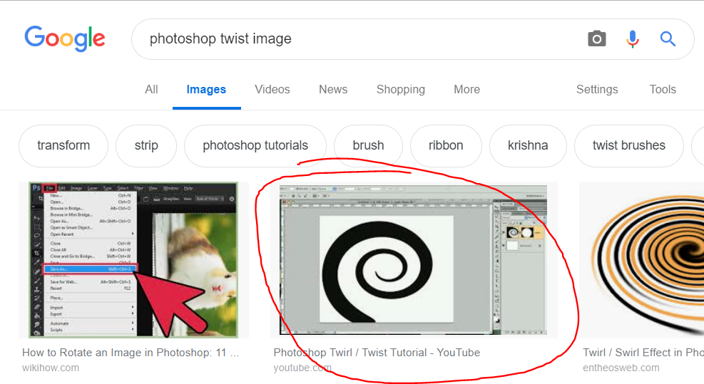

# 01 - Twisted [easy]
> As usual, the first one is very easy - just a little twisted, maybe.

This looks like something that should be very easy to solve using Photoshop.
Unfortunately I know very little Photoshop. So to Google we go:

The second hit takes us to YouTube where [pfltuts teaches us](https://www.youtube.com/watch?v=DEhZ4OUf6tc)
"[...] how to create a twirl / twist / swirly in Photoshop". Turns out
there is a filter called Twirl. Using the Twirl filter in reverse 
(`-108` degrees) on the twisted image results in a QR-code that can be
scanned with the HackyEaster app to solve the level:

