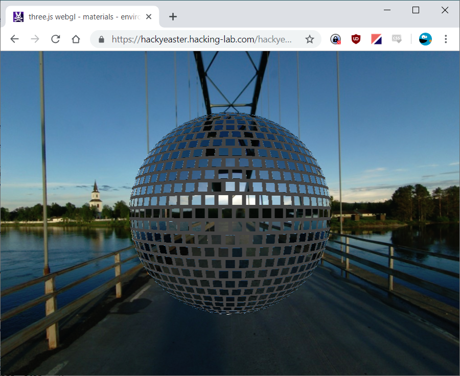
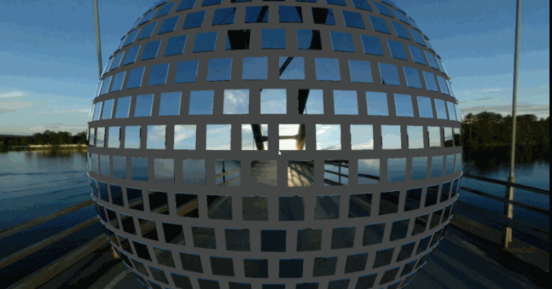
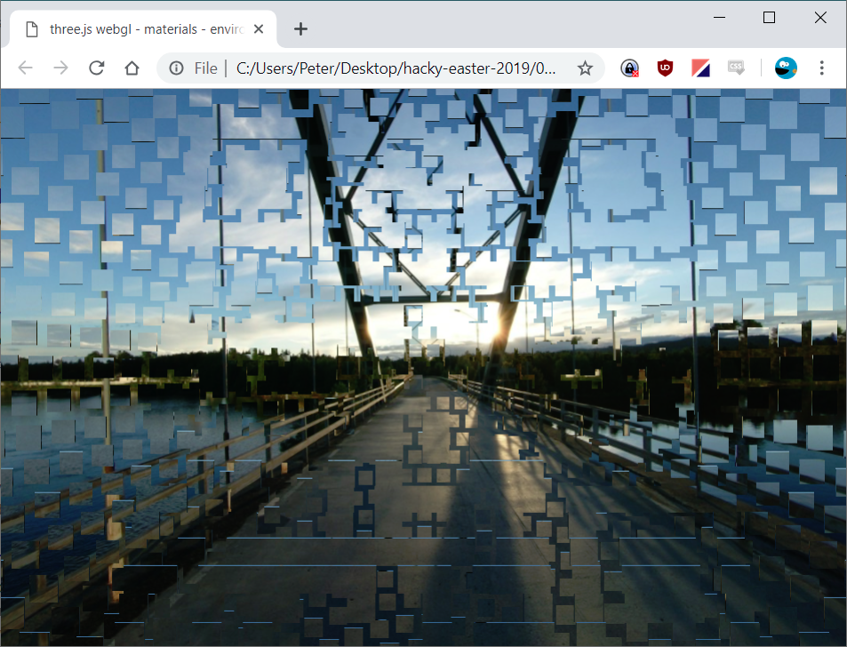
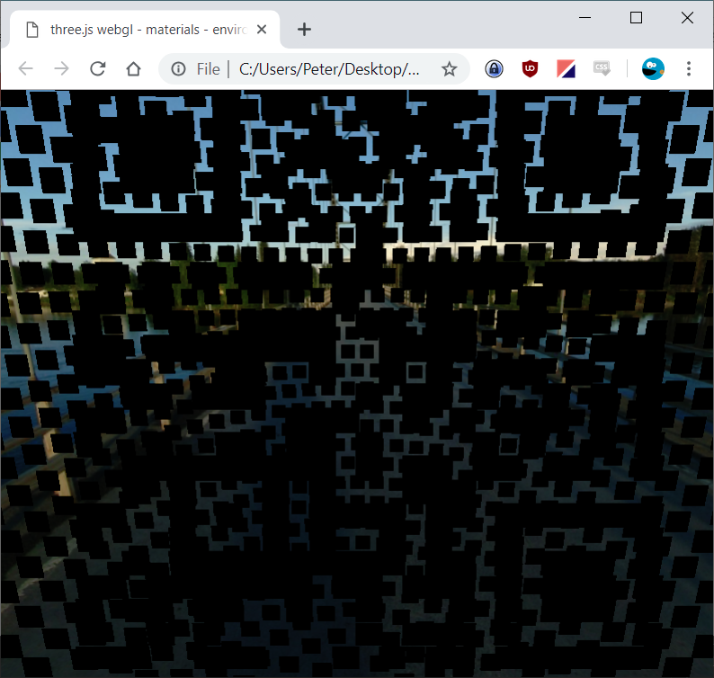
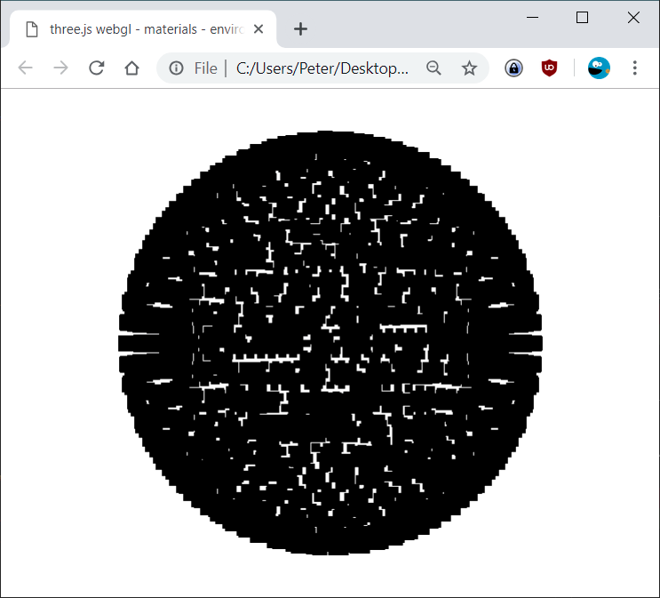
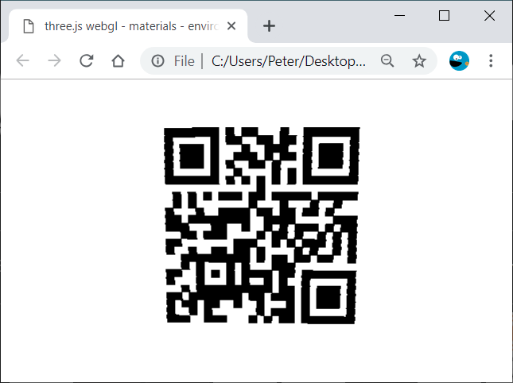
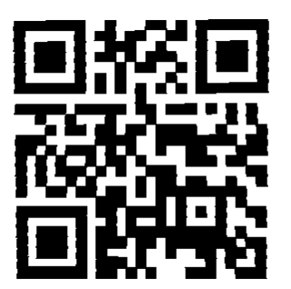

# 04 - Disco 2 [easy]

> This year, we dance outside, yeaahh! [See here.](disco2.html)

This challenge seems to be completely client side, so lets download
the disco2.html file so we can more easily edit it. A simple `<base>`
element makes all the relative links work. Oh, and disable the sound
too.

```diff
--- https://hackyeaster.hacking-lab.com/hackyeaster/challenges/disco2/disco2.html
+++ disco2.html
@@ -3,6 +3,7 @@
 
 <head>
     <title>three.js webgl - materials - environment maps</title>
+    <base href="https://hackyeaster.hacking-lab.com/hackyeaster/challenges/disco2/">
     <meta charset="utf-8">
     <meta name="viewport" content="width=device-width, user-scalable=no, minimum-scale=1.0, maximum-scale=1.0">
     <style>
@@ -39,9 +40,9 @@
     <!-- Spherical Map by Paul Debevec (http://www.pauldebevec.com/Probes/)  -->
 
     <script>
-        var audio = new Audio('theRealBeat.mp3');
-        audio.loop = true;
-        audio.play();
+        // var audio = new Audio('theRealBeat.mp3');
+        // audio.loop = true;
+        // audio.play();
```

With that done we can start exploring. The challenge looks like a 3d viewer
demo. You are placed into a 3d space where you can zoom in and out, and rotate
around a fixed center point. In the very middle is a disco ball:



Having a look at the code we notice some limits that currently
prevents us from zooming in and out too far:

```js
function init() {
    // ...
    controls.minDistance = 500;
    controls.maxDistance = 2500;
```

That seems like no fun, so we modify them to more permissive
values. Say `5` and `25000`... And what do you know, zooming 
*into* the ball reveals a QR code!



It's just a bit reflective. And rotated.

Let's tackle the rotation first. Maybe we can just alter some values of the
mirror pieces to set their rotations to 0? After some quick searching we find
the definitions for the mirror segements in the [js/mirrors.js](https://hackyeaster.hacking-lab.com/hackyeaster/challenges/disco2/js/mirrors.js)
file. However, since each entry consists of only three values it seems likely
that the definitions in the mirrors.js file is only for the (x, y, z)
locations. The rotation must be set somewhere else...

That somewhere else is not too hard to find. In the loop adding the mirror
pieces there is a call `mirrorTile.lookAt(center);` that looks very
suspicious:

```js
for (var i = 0; i < mirrors.length; i++) {
    var m = mirrors[i];
    mirrorTile = new THREE.Mesh(tileGeom, sphereMaterial);
    mirrorTile.position.set(m[0], m[1], m[2]);
    mirrorTile.lookAt(center);
    scene.add(mirrorTile);
}
```

Indeed commenting the `mirrorTile.lookAt(center);` line and
reloading the page each mirror piece is now facing the same
direction:



It's still not super easy to read the QR code though. What
we need to do is replace the material of the mirror pieces
with something less "mirrory".

Changing the material is also not very difficult. In the same
loop as we just modified we can see that each `mirrorTile` is
created using a `sphereMaterial`. Let's replace that with a
solid black material instead:

```diff
--- disco2.html (old)
+++ disco2.html
@@ -3,6 +3,7 @@
+            let blackMaterial = new THREE.MeshBasicMaterial({color: 0x000000});
             for (var i = 0; i < mirrors.length; i++) {
                 var m = mirrors[i];
-                mirrorTile = new THREE.Mesh(tileGeom, sphereMaterial);
+                mirrorTile = new THREE.Mesh(tileGeom, blackMaterial);
                 mirrorTile.position.set(m[0], m[1], m[2]);
                 //mirrorTile.lookAt(center);
                 scene.add(mirrorTile);

```

Well that worked, but didn't really have the effect one might have
hoped for. If anything this change probably made the QR-code even
harder to read:



Ok... So what if we remove everything else from the scene? Note that
we also set the screen background to white, as otherwise we would have
ended up with a completely black sceene with a completely black disco
ball in the middle.

```diff
--- disco2.html (old)
+++ disco2.html
@@ -67,12 +68,13 @@
             // SCENE
 
             scene = new THREE.Scene();
+            scene.background = new THREE.Color(0xffffff);
             sceneCube = new THREE.Scene();
 
             // Lights
 
             var ambient = new THREE.AmbientLight(0xffffff);
-            scene.add(ambient);
+            //scene.add(ambient);
 
             // Textures
 
@@ -111,11 +113,11 @@
             // Skybox
 
             cubeMesh = new THREE.Mesh(new THREE.BoxBufferGeometry(100, 100, 100), cubeMaterial);
-            sceneCube.add(cubeMesh);
+            //sceneCube.add(cubeMesh);
 
             //
@@ -129,18 +130,22 @@
 
             sphereMesh = new THREE.Mesh(geometry, sphereMaterial2);
 
-            scene.add(sphereMesh);
+            //scene.add(sphereMesh);
 
             // my things
```

With those changes we end up with what looks like something stright out of the game
[Antichamber](http://www.antichamber-game.com/):



As a final step, why don't we also remove the disco ball. It's actually not that
interesting now that it is completely black. Removing it is pretty easy since we
know that all the QR-code mirrors pieces are inside the ball. As such, the distance
to the center (0, 0, 0) coordinate of the disco ball mirror pieces must all be
larger than for any of the QR-code mirror pieces. A threshold distance of 395
was found after some experimenting.

```diff
--- disco2.html (old)
+++ disco2.html
@@ -140,6 +140,9 @@
                 
             let blackMaterial = new THREE.MeshBasicMaterial({color: 0x000000});
             for (var i = 0; i < mirrors.length; i++) {
+                let [x, y, z] = mirrors[i];
+                let dist = Math.sqrt(x*x + y*y + z*z);
+                if(dist >= 395) continue;
                 var m = mirrors[i];
                 mirrorTile = new THREE.Mesh(tileGeom, blackMaterial);
                 mirrorTile.position.set(m[0], m[1], m[2]);

```

With those changes we finally have a QR-code on the screen, and nothing else:



Actually, it turns out that we have been looking at it from the wrong direction
all this time. That QR-code is actually flipped horizontally. But luckily for us
it is still rendered in 3D, so we simply turn it around and finally we can scan
the code and complete the level!


