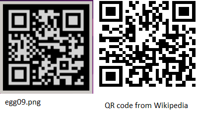

# 09 - rorriM rorriM [easy]

> Mirror, mirror, on the wall, who's the fairest of them all?
>
> [evihcra.piz](evihcra.piz)

From the title of the challenge (mirror) we realize that "evihcra.piz" should be
read as "archive.zip". But trying to open "archive.zip" does not work, it is not
(yet) a proper .zip file.

Opening the file in a hex editor (such as HxD) and looking at the very end of the
file we find `04 03 4B 50`, which when read in reverse matches the Hex signature
of the zip format, see [List of file signatures](https://en.wikipedia.org/wiki/List_of_file_signatures)
on Wikipedia. Presumably the entire file has been reversed. To undo the reversing
we can use some simple python: [unmirror.py](unmirror.py).

Reversing the file produces a proper "archive.zip" that we can extract. Within it
we find another file "90gge.gnp", which we rename to "egg09.png". Again this file
doesn't open correctly. However, this time the file is not reversed. Opening it in
a hex editor it actually looks mostly ok. In particular we see an `IHDR` sequence
towards the begining of the file and an `IEND` at the end. These sequences are both
part of the png format, so seeing them intact indicates that the entire file is not
modified the same way as the .zip file was.

Referring to the file signature list we notice that the very first bytes of the file
has been changed from the expected `89 50 4E 47 0D 0A 1A 0A` to instead be
`89 47 4E 50 0D 0A 1A`. Correcting the signature gives us an [egg09.png](egg09.png)
file that we can now successfully open:

The image "egg09.png" is (of course) also mirrored. But this is easily solved by
simply opening the image in paint and horizontally flipping it. This gives us
what appears to be a correct egg:

But looking closely at the QR code we notice that the white and black pixels are
seemingly reversed compared to what a normal QR code looks like:

Inversing the colors in the qr code part of the egg09_flipped.png (which
suprisingly enough can also be done in ms paint) we finally get the working QR
code for the level:

