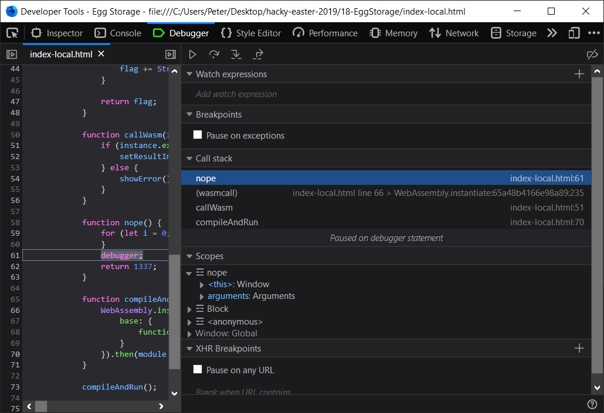
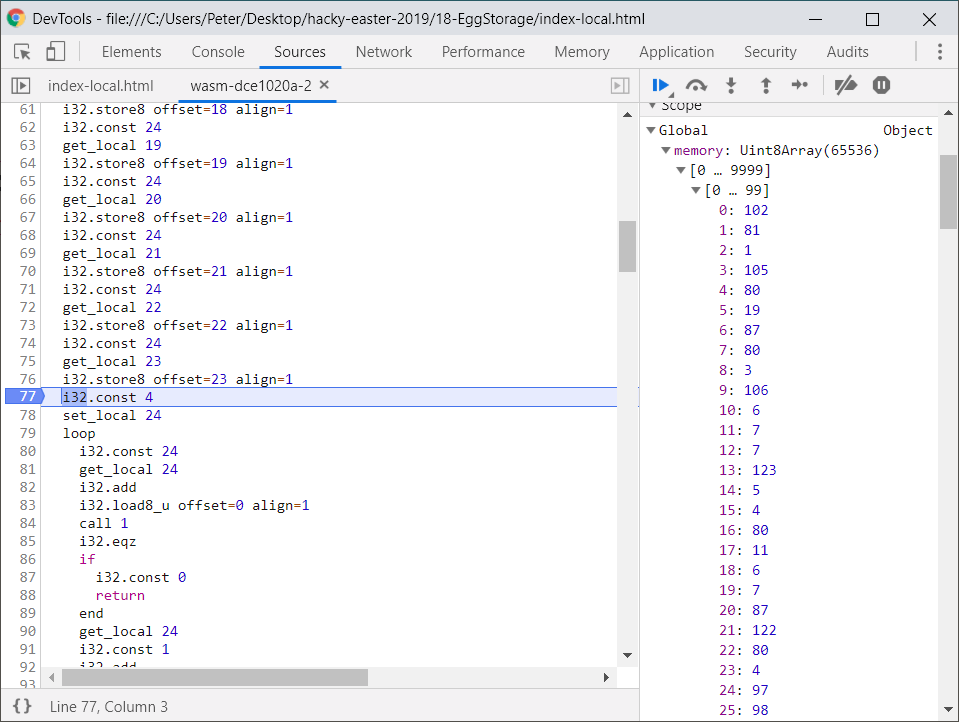

# WIP: 18 - Egg Storage
> Last year someone stole some eggs from Thumper.
> 
> This year he decided to use cutting edge technology to protect his eggs.
> 
> [Egg Storage](https://hackyeaster.hacking-lab.com/hackyeaster/challenges/eggstorage/index.html)


## Setup

Looking at the source we can directly see that this challenge is about WebAssembly:

```js
const content = new Uint8Array([0,97,115,109,1,0, ... ]);
// ...
function compileAndRun() {
    WebAssembly.instantiate(content, {
        base: {
            functions: nope
        }
    }).then(module => callWasm(module.instance));
}
compileAndRun();
```

We also notice that the level does things that makes debugging annoying, like
calling `debugger` in a loop. To avoid having to deal with that we instead
download the index.html file and modify it slightly to make it "run" locally:

```diff
--- index.html
+++ index-local.html
@@ -4,6 +4,7 @@
     <head>
         <meta charset="UTF-8">
         <title>Egg Storage</title>
+        <base href="https://hackyeaster.hacking-lab.com/hackyeaster/challenges/eggstorage/">
         <link href="main.css" rel="stylesheet" type="text/css"/>
     </head>
 
@@ -56,9 +57,8 @@
 
             function nope() {
                 for (let i = 0; i < 100; i++) {
-                    debugger;
                 }
-
+                debugger;
                 return 1337;
             }
```

We still keep a single debugger call in the `nope` function, so that
the debugger break once when it's called. Finally we also install
Firefox, since it seems to currently provide the better WebAssembly
debugging tools.


## Extracting The WebAssembly Textual Representation

After those setup steps, what we are really after is some way to get a more
human readable representation of the WebAssembly binary content. Some googling
seems to suggest that browsers can do this for us, and indeed after a quick
test that is the case. 

The perhaps easiest way to retreive the textual representation created
by the browser is by using the call stack in the Firefox developer tools.
By supplying some valid (24 characters) input and clicking Validate we 
hit the `debugger` breakpoint in the `nope` function. Here we can see
that we are called by the WebAssembly code:



Clicking on the (wasmcall) entry we are taken to a textual representation of
the binary WebAssembly code that is running, see [content.wat](content.wat).
Now all we have to do is reverse it... :sweat_smile:!


## Reversing The WebAssembly

Resources for this section:
* [Understanding WebAssembly text format](https://developer.mozilla.org/en-US/docs/WebAssembly/Understanding_the_text_format)
* [WebAssembly Specification](http://webassembly.github.io/spec/core/index.html)


We know that from the outside we call `validatePassword`, so this seems like
the place to start. The call is made as follows:

```js
const password = document.getElementById('pass').value.split('').map(e => e.charCodeAt(0));
// ...
if(instance.exports.validatePassword(...password))
// ...
```

The first line transforms the string value of the `'pass'` input to an array of
character codes, e.g. the input string `"abc"` would become the array `[97, 98, 99]`.

The `...` in `...password` is javascript ["Spread syntax"](https://developer.mozilla.org/en-US/docs/Web/JavaScript/Reference/Operators/Spread_syntax), resulting in `validatePassword` being called with `n` parameters, where `n` is the
number of characters in the `'pass'` input. But we know from the `{max,min}length` 
attributes in the HTML that the expected `n` here should be exactly 24.

Looking at the WebAssembly we see that the signature of `$func2` (which we from the
`export` declarations know is the `"validatePassword"` function) indeed has 24 input
paramters:

```wast
(func $func2 (param $var0 i32) (param $var1 i32) (param $var2 i32) (param $var3 i32) (param $var4 i32) (param $var5 i32) (param $var6 i32) (param $var7 i32) (param $var8 i32) (param $var9 i32) (param $var10 i32) (param $var11 i32) (param $var12 i32) (param $var13 i32) (param $var14 i32) (param $var15 i32) (param $var16 i32) (param $var17 i32) (param $var18 i32) (param $var19 i32) (param $var20 i32) (param $var21 i32) (param $var22 i32) (param $var23 i32) (result i32)
    ...
)
```

The first action performed by `"validatePassword"` is to call `$import0` and ignore
(`drop`) the result:

```wast
    call $import0   ;; base.functions
    drop
```

`$import0` is declared as `(import "base" "functions" (func $import0 (result i32)))`,
which we immediately recognize from the javascript side, where it is set to the
`nope` function:

```js
WebAssembly.instantiate(content, {
    base: {
        functions: nope
    }
}
```

Next follows a sequence of almost identical instructions, repeated for each
input paramter:

```wast
    i32.const 24           ;; Push 24 (memory offset) onto stack
    get_local $var0        ;; Push $var0 (1st param) onto stack
    i32.store8             ;; Store $var0 at memory offset 24+0
    i32.const 24
    get_local $var1
    i32.store8 offset=1    ;; Store $var1 at memory offset 24+1
    ...
    i32.const 24
    get_local $var23
    i32.store8 offset=23  ;; Store $var23 at memory offset 24+23
```

The result of the above code is that the value of each parameters is written to
the memory "array", starting at index 24 and continuing until index 47. The reason
that the code starts writing at index 24 is that there are already
24 entries predefined entries in the memory array, specified
as a data section:

```wast
(data (i32.const 0)
    "fQ\01iP\13WP\03j\06\07\07{\05\04P\0b\06\07WzP\04"
)
```

As such, the memory array at this point in execution contains the following:
```js
[102, 81, 1, 105, 80, 19, 87, 80, 3, 106, 6, 7, 7, 123, 5, 4, 80, 11, 6, 7, 87, 122, 80, 4, $var0, $var1, ..., $var23]
```

Switching to Chrome dev tools we can actually set breakpoints in the WebAssembly and
inspect the memory to assure ourselves that we haven't made a misstake yet:



Next is a loop that calls `validateRange`:

```wast
    i32.const 4           ;;
    set_local $var24      ;; $var24 = 4
    loop $label0
      i32.const 24        ;;
      get_local $var24    ;;
      i32.add             ;;
      i32.load8_u         ;;
      call $func1         ;; ret = validateRange(memory[$var24 + 24])
      i32.eqz             ;;
      if                  ;; if (ret == 0)
        i32.const 0       ;;   return 0
        return            ;;
      end
      get_local $var24
      i32.const 1
      i32.add
      set_local $var24    ;; $var24 += 1
      get_local $var23    ;;
      i32.const 24        ;; if ($var23 < 24)
      i32.le_s            ;;    goto $label0
      br_if $label0       ;;
    end $label0
```

The loop is either run once, if the last character of the input (`$var23`)
is >= 24, or run forever if `$var23` is < 24. Since characters below 24 in
the ascii table aren't easy to write in an input field, it seems pretty 
likely that the expected case is `$var23 >= 24` and the loop running exactly
one time. So `validateRange` is only really called once with the value of
`memory[4 + 24]`, the 5th character in the input (`$var4`).

`validateRange` ($func1) is a much simpler function. It's basically just a
bunch of `eq` and `or` instructions chained after each other. It returns
`1` if the input parameter matches any of (48, 49, 51, 52, 53, 72, 76, 88,
99, 100, 102, 114), or `0` otherwise:

```wast
(func $func1 (param $var0 i32) (result i32)
    i32.const 48         ;;
    get_local $var0      ;;
    i32.eq               ;; ret = ($var0 == 48)
    i32.const 49         ;;
    get_local $var0      ;;
    i32.eq               ;;
    i32.or               ;; ret = ($var0 == 49) || ret
    ;; ...
    if                   ;; 
      i32.const 1        ;;
      return             ;;
    end                  ;;
    i32.const 0          ;;
    return               ;; return (ret ? 1 : 0)
  )
```

The loop and `validateRange` together means that we now know that the
5th character in the input must be one of the 12 possible ascii values
listed previously, meaning it has to be one of:
`["0", "1", "3", "4", "5", "H", "L", "X", "c", "d", "f", "r"]`.
So yea, that was a lot of work for almost no reward...

Luckily, the next sequence of instructions are both easier to
interpret and gives us more information about the required input:

```wast
    get_local $var0       ;;
    i32.const 84          ;;
    i32.ne                ;;
    if                    ;; if ($var0 != 84)
      i32.const 0         ;;    return 0
      return              ;;
    end
    get_local $var1       ;;
    i32.const 104         ;;
    i32.ne                ;;
    if                    ;; if ($var1 != 104)
      i32.const 0         ;;    return 0
      return              ;;
    end
    get_local $var2       ;;
    i32.const 51          ;;
    i32.ne                ;;
    if                    ;; if ($var2 != 51)
      i32.const 0         ;;    return 0
      return              ;;
    end
    get_local $var3       ;;
    i32.const 80          ;;
    i32.ne                ;;
    if                    ;; if ($var3 != 80)
      i32.const 0         ;;    return 0
      return              ;;
    end
```

It's just a bunch of comparisons between input character and
hardcoded values. With those we now know the following must be
true:

```
$var0 == 84  ("T")
$var1 == 104 ("h")
$var2 == 51  ("3")
$var3 == 80  ("P")
$var4 in ["0", "1", "3", "4", "5", "H", "L", "X", "c", "d", "f", "r"]
```

___
Again, remember that this can be verified by stepping the code
in the Chrome developer tools; After entering a password that
starts with "Th3P0" (where the 0 can be replaced by any of the
$var4 range of possible values) we continue past all the
instructions that we have looked at so far.
___

Next are a couple of comparisons between pairs of input characters,
testing that they are the same value:

```wast
    get_local $var23      ;;
    get_local $var17      ;;
    i32.ne                ;;
    if                    ;; if ($var23 != $var17)
      i32.const 0         ;;    return 0
      return
    end
    get_local $var12      ;;
    get_local $var16      ;;
    i32.ne                ;; if ($var12 != $var16)
    if                    ;;    return 0
      i32.const 0         ;;
      return              ;;
    end
    get_local $var22      ;;
    get_local $var15      ;;
    i32.ne                ;; if ($var22 != $var15)
    if                    ;;    return 0
      i32.const 0         ;;
      return              ;;
    end
```

Followed by a bunch of more complicated relations between
character pairs:

```wast
    get_local $var5       ;;
    get_local $var7       ;;
    i32.sub               ;;
    i32.const 14          ;;
    i32.ne                ;;
    if                    ;; if (($var5 - $var7) != 14)
      i32.const 0         ;;    return 0
      return              ;;
    end
    get_local $var14      ;;
    i32.const 1           ;;
    i32.add               ;;
    get_local $var15      ;;
    i32.ne                ;;
    if                    ;; if (($var14 + 1) != $var15)
      i32.const 0         ;;    return 0
      return              ;;
    end
    get_local $var9       ;;
    get_local $var8       ;;
    i32.rem_s             ;;
    i32.const 40          ;;
    i32.ne                ;;
    if                    ;; if (($var9 % $var8) != 40)
      i32.const 0         ;;    return 0
      return              ;;
    end
```

Followed by even more complicated relations:

```wast
    get_local $var5       ;;
    get_local $var9       ;;
    i32.sub               ;;
    get_local $var19      ;;
    i32.add               ;; res = ($var5 - $var9) + $var19
    i32.const 79          ;;
    i32.ne                ;;
    if                    ;; if (res != 79)
      i32.const 0         ;;    return 0
      return              ;;
    end
    get_local $var7       ;;
    get_local $var14      ;;
    i32.sub               ;;
    get_local $var20      ;;
    i32.ne                ;;
    if                    ;; if (($var7 - $var14) != $var20)
      i32.const 0         ;;    return 0
      return              ;;
    end
    get_local $var9       ;;
    get_local $var4       ;;
    i32.rem_s             ;;
    i32.const 2           ;;
    i32.mul               ;; res = ($var9 % $var4) * 2
    get_local $var13      ;;
    i32.ne                ;;
    if                    ;; if (res != $var13)
      i32.const 0         ;;    return 0
      return              ;;
    end
    get_local $var13      ;;
    get_local $var6       ;;
    i32.rem_s             ;;
    i32.const 20          ;;
    i32.ne                ;;
    if                    ;; if ($var13 % $var6 == 20)
      i32.const 0         ;;    return 0
      return              ;;
    end
    get_local $var11      ;;
    get_local $var13      ;; 
    i32.rem_s             ;; 
    get_local $var21      ;;
    i32.const 46          ;;
    i32.sub               ;;
    i32.ne                ;;
    if                    ;; if (($var11 % $var13) != ($var21 - 46))
      i32.const 0         ;;    return 0
      return              ;;
    end
    get_local $var7       ;;
    get_local $var6       ;;
    i32.rem_s             ;;
    get_local $var10      ;;
    i32.ne                ;; if (($var7 % $var6) != $var10)
    if                    ;;    return 0
      i32.const 0         ;;
      return              ;;
    end
    get_local $var23      ;;
    get_local $var22      ;;
    i32.rem_s             ;;
    i32.const 2           ;;
    i32.ne                ;;
    if                    ;; if (($var23 % var22) != 2)
      i32.const 0         ;;    return 0
      return              ;;
    end
```

Finally there is a large loop that accumulates both the sum
and the xor of memory between index 24+4 and 24+23 inclusive.
(Remember that we know since earlier that these memory
locations has the same value as the vars $var4 through $var23):

```wast
    i32.const 4           ;;
    set_local $var24      ;; $var24 = 4
    i32.const 0           ;;
    set_local $var25      ;; $var25 = 0
    i32.const 0           ;;
    set_local $var26      ;; $var26 = 0
    loop $label1
      get_local $var25    ;;
      i32.const 24        ;;
      get_local $var24    ;;
      i32.add             ;;
      i32.load8_u         ;;
      i32.add             ;;
      set_local $var25    ;; $var25 += mem[$var24 + 24]
      get_local $var26    ;;
      i32.const 24        ;;
      get_local $var24    ;;
      i32.add             ;; 
      i32.load8_u         ;;
      i32.xor             ;;
      set_local $var26    ;; $var26 ^= mem[$var24 + 24] 
      get_local $var24    ;;
      i32.const 1         ;;
      i32.add             ;;
      set_local $var24    ;; $var24 += 1
      get_local $var24    ;;
      i32.const 24        ;;
      i32.le_s            ;; if ($var24 >= 24)
      br_if $label1       ;;    break
    end $label1
```

The accumlated sum and xor is then checked against two know constants:

```wast
    get_local $var25      ;;
    i32.const 1352        ;;
    i32.ne                ;; // $var25 == sum of numbers
    if                    ;; if ($var25 != 1352)
      i32.const 0         ;;    return 0
      return              ;;
    end
    get_local $var26      ;;
    i32.const 44          ;;
    i32.ne                ;; // $var26 == xor of numbers
    if                    ;; if ($var26 != 44)
      i32.const 0         ;;    return 0
      return              ;;
    end
```

If we manage to get past all that, the final instructions calls $func3
("decrypt") and returns 1, signaling to the caller that the input was
correct. The decrypt function performs a per character xor between
the predefined data and the input data, then storing it back to memory:

```wast
    call $func3
    drop
    i32.const 1
    return
  )
  ;; decrypt
  (func $func3 (result i32)
    (local $var0 i32)
    loop $label0
      get_local $var0
      get_local $var0
      i32.load8_u       ;; a = mem[$var0]
      i32.const 24      ;;
      get_local $var0   ;;
      i32.add           ;;
      i32.load8_u       ;; b = mem[$var0 + 24]
      i32.xor           ;;
      i32.store8        ;; mem[$var0] = a ^ b
      get_local $var0   ;;
      i32.const 1       ;;
      i32.add           ;;
      set_local $var0   ;; $var0 += 1
      get_local $var0   ;;
      i32.const 24      ;;
      i32.le_s          ;; if ($var0 >= 24)
      br_if $label0     ;;    break
    end $label0
    i32.const 1337
    return
  )
```

The xored memory is then read and used on the javascript side in
`getEgg` to return the flag for the level:

```js
function getEgg(instance) {
    const memory = new Uint8Array(instance.exports['0'].buffer);
    let flag = '';
    for (let i = 0; i < 24; i++) {
        flag += String.fromCharCode(memory[i]);
    }
    return flag;
}
```

Puh, that was a lot of WebAssembly and a lot of relations...
Summarizing the relations we end up with the following system of
(pseudo) equations:

```
$var0  == 84  ("T")
$var1  == 104 ("h")
$var2  == 51  ("3")
$var3  == 80  ("P")
$var4  in ["0", "1", "3", "4", "5", "H", "L", "X", "c", "d", "f", "r"]
$var5  == 14 + $var7 == 79 - $var19 + $var9
$var6  == ?
$var7  == $var5 - 14 == $var20 + $var14
$var8  == ? 
$var9  == $var5 + $var19 - 79
$var11 == ?
$var10 == ?
$var12 == $var16
$var13 == ($var9 % $var4) * 2
$var14 == $var15 - 1 == $var7 - $var20
$var15 == $var22 == $var14 + 1
$var16 == $var12
$var17 == $var23
$var18 == ?
$var19 == 79 - $var5 + $var9
$var20 == $var7 - $var14
$var21 == ?
$var22 == $var15
$var23 == $var17

$var9 % $var8 == 40
$var13 % $var6 == 20
$var11 % $var13 == $var21 - 46
$var7 % $var6 == $var10
$var23 % $var22 == 2
$var4 + $var5 + ... + $var23 == 1352
$var4 ^ $var5 ^ ... ^ $var23 == 44
```

Now all that remains is to find an input that matches all of
those. Surely that's an easy task... :see_no_evil:

## Solving Relations

Replace equallity (e.g. `$var23 == $var17`). Note `x ^ x == 0`, so can
remove from last xor equation.

```
$var4  in ["0", "1", "3", "4", "5", "H", "L", "X", "c", "d", "f", "r"]
$var5  == 14 + $var7 == 79 - $var19 + $var9
$var6  == ?
$var7  == $var5 - 14 == $var20 + $var14
$var9  == $var5 + $var19 - 79
$var11 == ?
$var10 == ?
$var12 == ?
$var13 == ($var9 % $var4) * 2
$var14 == $var15 - 1 == $var7 - $var20
$var15 == $var14 + 1
$var17 == ?
$var18 == ?
$var19 == 79 - $var5 + $var9
$var20 == $var7 - $var14
$var21 == ?

$var9 % $var8 == 40
$var13 % $var6 == 20
$var11 % $var13 == $var21 - 46
$var7 % $var6 == $var10
$var17 % $var15 == 2

$var4 + $var5 + $var6 + $var7 + $var8 + $var9 + $var10 + $var11 + 2*$var12 + $var13 + $var14 + 2*$var15 + 2*$var17 + $var18 + $var19 + $var20 + $var21 == 1352

$var4 ^ $var5 ^ $var6 ^ $var7 ^ $var8 ^ $var9 ^ $var10 ^ $var11 ^ $var13 ^ $var14 ^ $var18 ^ $var19 ^ $var20 ^ $var21 == 44
```


```
$var4  in ["0", "1", "3", "4", "5", "H", "L", "X", "c", "d", "f", "r"]
$var5  == 79 - $var19 + $var9
$var6  == ?
$var9  == $var5 + $var19 - 79
$var11 == ?
$var10 == ?
$var12 == ?
$var13 == ($var9 % $var4) * 2
$var14 == $var15 - 1
$var15 == $var14 + 1
$var17 == ?
$var18 == ?
$var19 == 79 - $var5 + $var9
$var21 == ?

$var9 % $var8 == 40
$var13 % $var6 == 20
$var11 % $var13 == $var21 - 46
($var5 - 14) % $var6 == $var10
$var17 % $var15 == 2

$var4 + 2*$var5 + $var6 + $var8 + 2*$var9 + $var10 + $var11 + 2*$var12 + $var13 + 2*$var15 + 2*$var17 + $var18 + $var21 == 1352 + 2*14 - 79

$var4 ^ $var5 ^ $var6 ^ ($var5 - 14) ^ $var8 ^ $var9 ^ $var10 ^ $var11 ^ $var13 ^ $var14 ^ $var18 ^ $var19 ^ (($var5 - 14) - $var14) ^ $var21 == 44
```