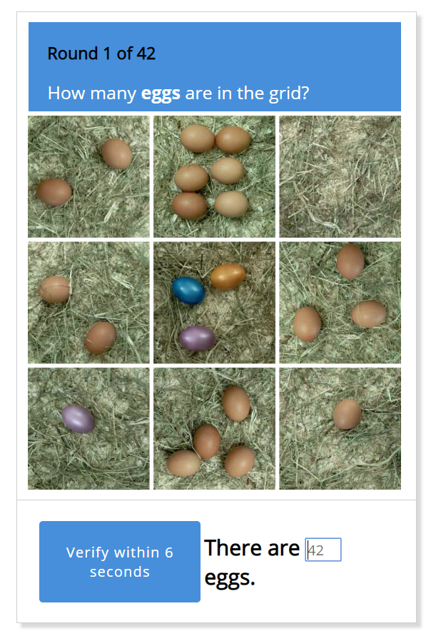
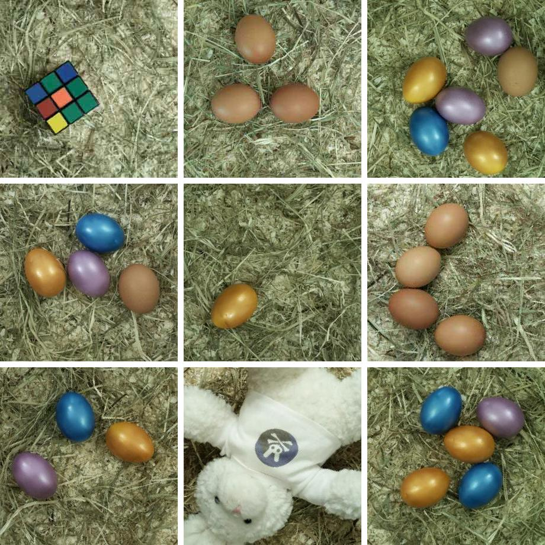
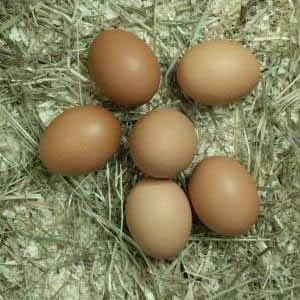
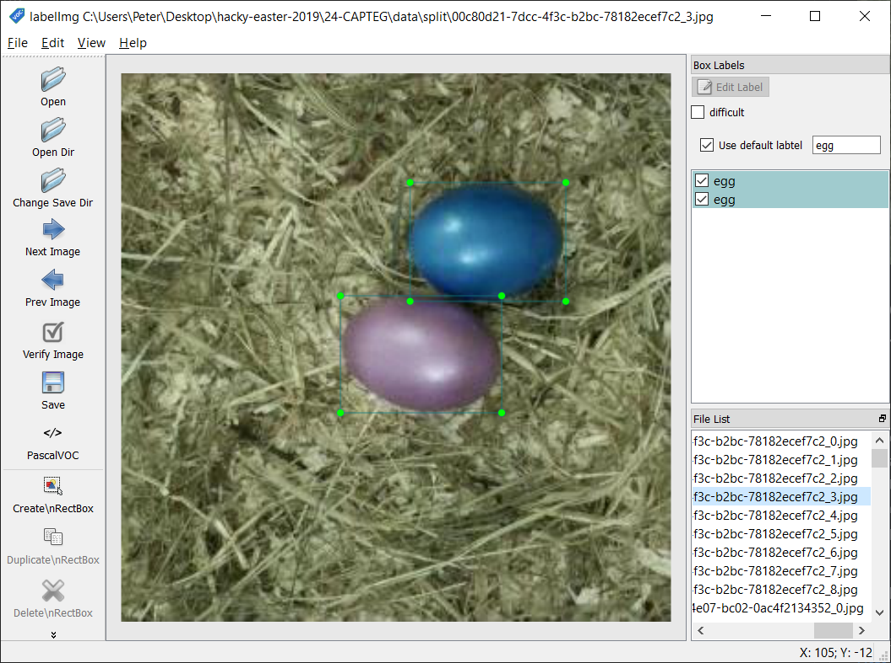

# WIP: 24 - CAPTEG [hard]
> CAPTEG - Completely Automated Turing test to know how many Eggs are in the Grid
> 
> CAPTEG is almost like a CAPTCHA. But here, you have to proof you are a bot that can
> count the eggs in the grid quickly. Bumper also wanna train his AI for finding eggs
> faster and faster ;)
> 
> [CAPTEG page](http://whale.hacking-lab.com:3555/)
> 
> No Easter egg here. Enter the flag directly on the flag page.


## Overview

This looks like it is this year's machine learning challenge. As opposed
to [last year's challenge](https://github.com/verath/hacky-easter-2018/tree/master/23-RapbidLearning),
which was a fairly basic machine learning task about predicting a boolean
property based on a bunch of other numeric properties, this year it is
about "computer vision".

As the task description already states, the challenge itself is fairly
simple. You are shown an image containing (among other things) some
number of eggs (of varying colors) and your task is to answer how many
eggs are in the image. The hard part is that you only have a very short
time (approx. 7 seconds) to provide an answer, and that you must answer
correctly 42 times in a row:



The remainder of this write up will be structured around the
following steps, which were taken in order to solve the level:

1. Downloading training data
2. Annotating data (and choosing a framework)

Most of these steps follow closely to the steps taken by Dat Tran
in his guide called "[How to train your own Object Detector with TensorFlow’s Object Detector API](https://towardsdatascience.com/how-to-train-your-own-object-detector-with-tensorflows-object-detector-api-bec72ecfe1d9)".

## Note About Dependencies

The python scripts used for this challenge uses a couple of external 
dependencies. The dependencies are mostly managed by 
[pipenv](https://pipenv.readthedocs.io/en/latest/), which is basically
a combination of pip and virtualenv. To setup the appropriate environment
run `pipenv install`. Each script must also be run within the virtual
environment. This is done either by activating the environment once via
`pip shell`, or explicitly running each script in the environment by
using `pipenv run`.

In addition to pipenv, some dependencies were not available on pip, so they were
instead included as submodules. To fetch these use 
`git submodule update --init --recursive`.

Finally, since we are using the GPU version of TensorFlow some system level
dependencies must be installed. See [GPU support | TensorFlow](https://www.tensorflow.org/install/gpu).
Note that the versions listed on that page is strict. CUDA 10.0 is required,
using 10.1 instead does NOT work.

All scripts were created and run on Python 3.7.


## 1. Downloading training data

Regardless of technique used later on, we know we will need some data to
train/test/validate against. So let's gather that first. In this level
data is of course variants of "CAPTEG" image.

Poking around at the site we notice that visiting the index page gives us 
a `sessionId` cookie, and that this cookie is required for the
[`/picture`](http://whale.hacking-lab.com:3555/picture) endpoint to give us
an image. The `/picture` endpoint also stopps serving the image when the time
runs out, instead just giving us a message saying "timeout, go to index page 
to get a new round".

So to download the images we use the following sequence:

1. Visit the [index page](http://whale.hacking-lab.com:3555/) so that we
   get a new `sessionId`.
2. Download the image from [/picture](http://whale.hacking-lab.com:3555/picture).
3. Clear our `sessionId` cookie.
4. Goto 1.

The [data_dl.py](data_dl.py) script does just that, and stores the images
in the /data folder:

```console
> python data_dl.py
```

Since we will have to manually annotate the images afterwards we probably have
no use for more than 50 or so (depending of course on how much time we feel like
spending on annotation). Each downloaded file looks something like this:



As can be seen in the above image it's pretty obvious that each image is really
made up of 9 smaller images. My general understanding of the coming model training
is that one probably want to keep the size of each individual image small, or GPU
memory (or RAM?) might be a problem. The [`data_split.py`](data_split.py)
therefore splits each image in the /data folder into its 9 parts, storing them in
/data/split.

```console
> python data_split.py
```

With that we end up with smaller images looking like this:




## 2. Annotating data (and choosing a framework)

Now that we have a lot of images we need to annotate them so that the model can
learn what is actually in the image. Since we only care about finding eggs, we
will only be using a single class(label?), "egg". However, before we get started
with annotating we now have to actually decide on the framework to use so that
we can produce labels that are appropriate for the framework.

After extensive research (read 20 minutes of googling) I decided to use 
[TensorFlow's ObjectDetection API](https://github.com/tensorflow/models/tree/master/research/object_detection) primarily because documentation looked good. 
In addition, there is also this step-by-step guide
"[How to train your own Object Detector with TensorFlow’s Object Detector API](https://towardsdatascience.com/how-to-train-your-own-object-detector-with-tensorflows-object-detector-api-bec72ecfe1d9)"
written by Dat Tran covering how one would train a model to detect a single
label. Tram is detecting raccoons, but it seems easy enough to adjust for 
detecting something else. Such as eggs :smile:.

Tran uses [LabelImg](https://github.com/tzutalin/labelImg) for creating the
annotations, so we will do so as well. LabelImg is a very simple program.
You start by pressing Open Dir selecting the /data/split directory. Then setting
the Save Dir to somewhere. I picked /data/split/labels, to keep things nicely
grouped. Then off we go:



The annotations are stored as `.xml` files, following the PASCAL VOC format (as
far as I understand, PASCAL VOC is actually a dataset and the PASCAL VOC format
is just using the same format as was used for the dataset, but I may also be
completely mistaken). Below is the contents of an annotation file for an image 
containing a single egg:

```xml
<annotation>
	<folder>split</folder>
	<filename>0a8d8da0-c049-42c0-ba20-cbcf67e8b702_1.jpg</filename>
	<path>C:\Users\Peter\Desktop\hacky-easter-2019\24-CAPTEG\data\split\0a8d8da0-c049-42c0-ba20-cbcf67e8b702_1.jpg</path>
	<source>
		<database>Unknown</database>
	</source>
	<size>
		<width>300</width>
		<height>300</height>
		<depth>3</depth>
	</size>
	<segmented>0</segmented>
	<object>
		<name>egg</name>
		<pose>Unspecified</pose>
		<truncated>0</truncated>
		<difficult>0</difficult>
		<bndbox>
			<xmin>49</xmin>
			<ymin>157</ymin>
			<xmax>139</xmax>
			<ymax>223</ymax>
		</bndbox>
	</object>
</annotation>
```

Unfortunately, the `.xml` based format is not something that TF (TensorFlow) can
natively read so we have to do some conversions. Since the format we use is the
same as Tran did, we can make use of his conversion scripts to convert first from
.xml to .csv, then from .csv files to `TFRecords` that TF understands.

```console
python data_xml_to_csv.py
```

Produces a _labels.csv in the /data/split/labels directory (the underscore is
to sort it first, since I placed it in the same directory as .xml label files).
The file is just a shorter representation of the .xml files:

```csv
filename,width,height,class,xmin,ymin,xmax,ymax
00c80d21-7dcc-4f3c-b2bc-78182ecef7c2_3.jpg,300,300,egg,157,60,241,125
00c80d21-7dcc-4f3c-b2bc-78182ecef7c2_3.jpg,300,300,egg,119,121,208,186
00c80d21-7dcc-4f3c-b2bc-78182ecef7c2_4.jpg,300,300,egg,93,1,162,80
...
```

Finally, we convert the .csv file to a TF records file:

```console
python run .\data_generate_tfrecord.py --csv_input="C:\Users\Peter\Desktop\hacky-easter-2019\24-CAPTEG\data\split\labels\_labels.csv" --image_dir="C:\Users\Peter\Desktop\hacky-easter-2019\24-CAPTEG\data\split" --output_path=train.records
```
